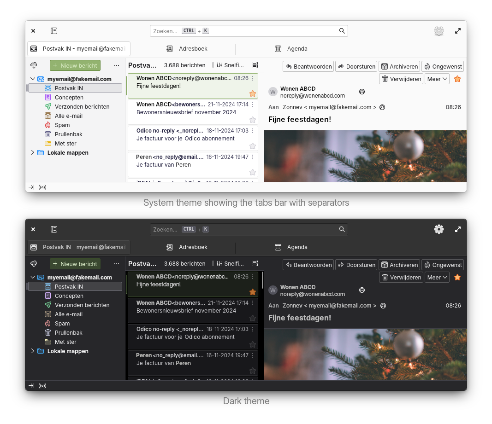

# An elementary OS theme for Thunderbird



## ⬇️ Installation

For now theme installation is supported for:

1. [🐦 Thunderbird 📦 Flatpak version](https://flathub.org/apps/details/org.mozilla.Thunderbird). Install it using AppCenter.
2. [🐦 Thunderbird 📦 download package](https://www.thunderbird.net/en-US/). [How to install for advanced users](https://support.mozilla.org/en-US/kb/installing-thunderbird-linux?redirectslug=installing-thunderbird-ubuntu-linux&redirectlocale=en-US#w_installing-thunderbird-manually-for-advanced-users).

**You can use Main menu to create a Thunderbird desktop entry:**
- Download Thunderbird from the [website](https://www.thunderbird.net/en-US/) and extract in a folder of your choice.
- Open [Main menu](https://flathub.org/apps/page.codeberg.libre_menu_editor.LibreMenuEditor) (install it in AppCenter), click on the Settings wheel in the app list on the top right and select `New launcher`.
- Fill in each section starting with **Appearance**. Press the **folder icon** and go to your Thunderbird folder and in `chrome/icons/default` select `default256.png`.
- In **Description** you can fill in `Thunderbird` as name of the launcher.
- In **Execution** and **Default command** you fill in your Thunderbird folder location like `home/<username>/Apps/thunderbird/thunderbird` where the last "thunderbird" is the run file.
- In **Visibility** you can toggle **Show an animation until the application is visible** and **Show this application in the main menu** `on`.
- Then under that in **Menu** you can choose in which category the launcher is showing, like `Internet`.
- Save by clicking the `save` button in the top bar of the window.

**Now you need a dot under the Thunderbird icon when opened in the dock. Edit the desktop entry file:**
- In the left list of **Main menu**, select Thunderbird and scroll down to **Advanced** section and press the icon on the right, this opens **Code** with the desktop entry file visible.
- Then open **Thunderbird** and **Terminal**.
- Type `xprop WM_CLASS` in the **Terminal**, the result: your mouse cursor changes into a crosshair.
- You can now click your crosshair cursor on the Thunderbird window and you will see the WM_Class of Thunderbird in Terminal.
- Go to Code and type a new line in the `Desktop Entry` section, something like: `StartupWMClass=thunderbird`, where **thunderbird** is the result of `xprop WM_class`. Code will automatically save the file so just close all and move the Thunderbird icon from Slingshot to the Dock and enjoy the fully working and integrated Thunderbird.

Use this one line install script to install theme. Just copy the line to your terminal and press enter:

```bash
bash <(wget --quiet --output-document - "https://raw.githubusercontent.com/Zonnev/elementaryos-thunderbird-theme/main/install.sh")
```

## ➕ After installation

1. In `Settings > Configuration editor` you can make the bottom window corners rounded by setting `widget.gtk.rounded-bottom-corners.enabled` to `true`.
2. If you installed the **Flatpak** version of Thunderbird and you want to make use of the elementary OS **accent colors**, you have to copy the `usr/share/themes` folder to `home/.themes`:
   - Type or copy-paste in Terminal `mkdir -p $HOME/.themes` to make the folder.
   - Then type `cp -r /usr/share/themes/* $HOME/.themes/` to copy the folder and place the files in the folder you have made.
   - And after that `flatpak override --user org.mozilla.Thunderbird --filesystem=$HOME/.themes` to make Flatpak version follow the elementary OS style sheets in the folder.

## ✖️ Uninstall this theme

To uninstall this theme, do the following:
1. Go to `Settings > Configuration editor`, Configuration Editor is the last option in Settings.
2. Search for `toolkit.legacyUserProfileCustomizations.stylesheets` and put it on `false`. Then restart the Thunderbird: it does not show the theme anymore.

You can now delete the chrome folder(s) by doing the following:
1. Find the `chrome` folder(s) in `~/.var/app/org.mozilla.Thunderbird/.thunderbird/<profilefolder>/` if you installed as Flatpak, or in `~/.thunderbird/<profilefolder>/` if you installed the download package.
2. Delete the `chrome` folder in your profile folder(s). After this you have completely uninstalled the theme.

