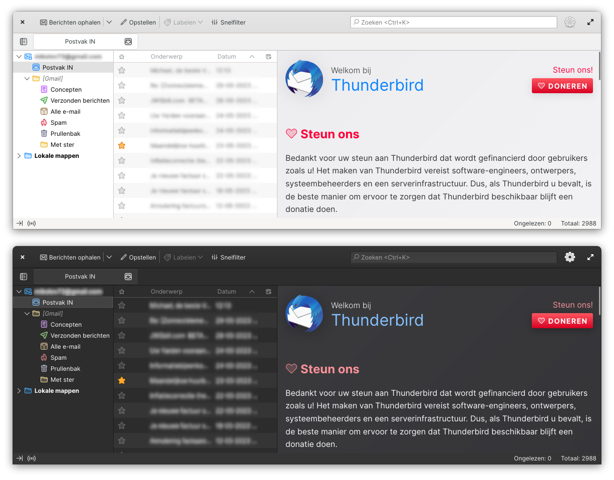

# An elementary OS theme for Thunderbird

## Installation

1. Install Thunderbird in AppCenter.
2. Create the `chrome` folder in: `~/.var/app/org.mozilla.Thunderbird/.thunderbird/<profilefolder>`.
3. Put the `userChrome.css` file in there.
4. In Thunderbird enter the Menu and select Settings, scroll all the way down till you see the Config Editor button. Press the button and search for `toolkit.legacyUserProfileCustomizations.stylesheets` and set it to `true`.
4. Restart Thunderbird and the theme should be applied.
5. Disable the Title bar in Thunderbird.
